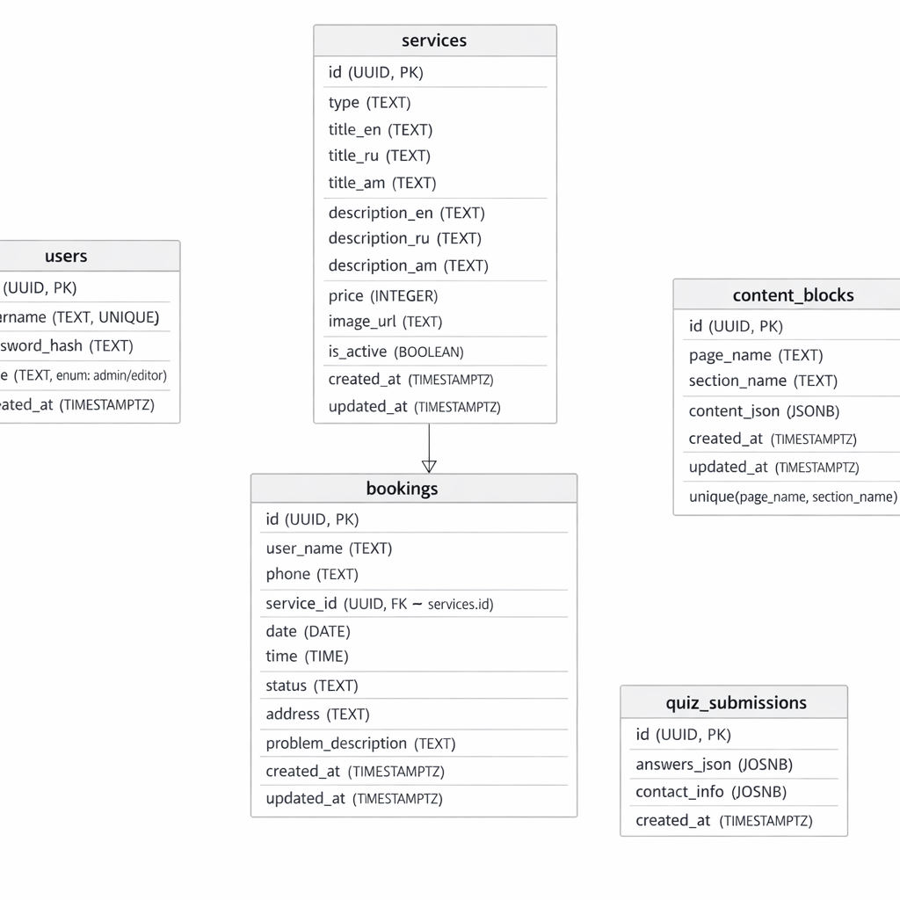
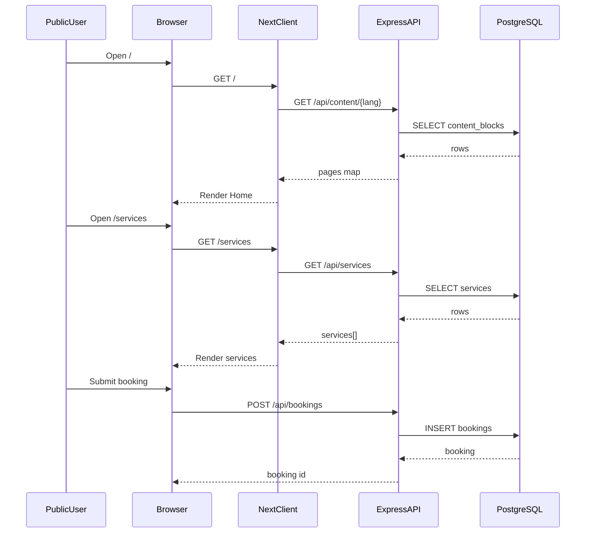
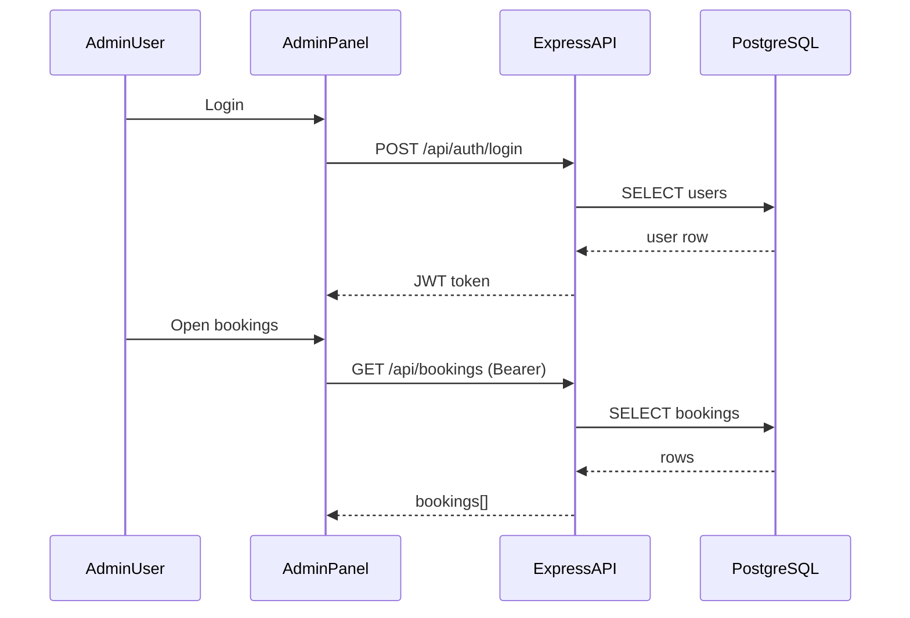

# Implementation dump (what was built + where it lives)

This file summarizes **all implemented changes**, grouped by area, and includes the generated images/diagrams.

## Images

### Database schema ERD

### Setup screenshot (reference)

## Architecture overview

- **Monorepo** with npm workspaces:
  - `server/`: Express REST API + PostgreSQL
  - `client/`: Public website (Next.js)
  - `admin/`: Admin panel (Vite + React)
  - `e2e/`: Playwright E2E tests

## Root (repo-level) changes

### `/package.json`

- Declares workspaces: `server`, `client`, `admin`, `e2e`.
- Scripts to run each app and tests.
- **Workspace command style** uses `npm run <script> -w <workspace>` (example: `npm run dev -w server`).

### `/.gitignore`

- Ignores `node_modules/`, `.next/`, `dist/`, coverage outputs, and `.env*` secrets.

### `/README.md`

- Documents local development commands for all workspaces.

### `.github/workflows/ci.yml`

- Basic CI workflow (install + run unit tests).

## Backend: `server/` (Express + PostgreSQL)

### Important entrypoints

- `server/src/index.js`
  - Loads env from `server/.env` by **absolute path** (relative to `server/`), then starts HTTP server.
  - This is important because running from different working directories can otherwise miss `.env`.

- `server/src/app.js`
  - Express app factory used by runtime and by tests.
  - Wires middleware + all routers under `/api/*`.

- `server/src/config/db.js`
  - Creates a singleton PostgreSQL `Pool`.
  - Exposes `query()` / `withClient()` helpers used by routes.

### Database schema, migrations, seed

- `server/migrations/001_init.sql`
  - Creates tables:
    - `users`
    - `services`
    - `bookings`
    - `content_blocks`
    - `quiz_submissions`
  - Adds indexes and `updated_at` triggers.
  - Uses `pgcrypto` + `gen_random_uuid()` for UUIDs.

- `server/migrations/002_content_block_versions.sql`
  - Creates `content_block_versions` table for **append-only history**.
  - One row is written for **each** admin/editor content update.

- `server/scripts/migrate.js`
  - Applies SQL files in `server/migrations/` once (tracked via `_migrations` table).
  - **Loads env from `server/.env`** so `DATABASE_URL` works when you run `npm run migrate -w server`.

- `server/scripts/seed.js`
  - Inserts an initial admin user and minimal services + content blocks.
  - **Loads env from `server/.env`** so `DATABASE_URL` works when you run `npm run seed -w server`.

### Middleware

- `server/src/middleware/auth.js`
  - `verifyToken` (JWT parsing/validation)
  - `requireRole` / `requireAnyRole` for authorization checks.

- `server/src/middleware/errorHandler.js`
  - Centralized JSON error response.

### Routes (API surface)

- `server/src/routes/auth.js`
  - `POST /api/auth/login`: validate admin creds, return JWT.
  - `POST /api/auth/register` (admin only): create admin/editor.
  - `GET /api/auth/users` (admin only): list users.
  - `DELETE /api/auth/users/:id` (admin only): delete user (cannot delete yourself).

- `server/src/routes/services.js`
  - `GET /api/services`: public list (active by default), filter by type.
  - `POST /api/services`: create (admin/editor).
  - `PUT /api/services/:id`: update (admin/editor).
  - `DELETE /api/services/:id`: soft-hide service (`is_active=false`) (admin only).

- `server/src/routes/bookings.js`
  - `POST /api/bookings`: public booking creation.
  - `GET /api/bookings`: admin/editor list (status + pagination).
  - `PUT /api/bookings/:id/status`: admin/editor status update.

- `server/src/routes/content.js`
  - `GET /api/content/:lang`: public content (returns language-resolved blocks).
  - `GET /api/content/blocks`: admin/editor raw blocks for editing.
  - `PUT /api/content`: admin/editor upsert/update blocks.
  - `GET /api/content/blocks/:id/versions`: admin/editor content history (last 50).

- `server/src/routes/upload.js`
  - `POST /api/upload`: admin/editor image upload via `multer`.
  - Files are served at `/uploads/*`.

- `server/src/routes/quizSubmissions.js`
  - `POST /api/quiz-submissions`: public submit.
  - `GET /api/quiz-submissions`: admin/editor list.

### Backend tests

- `server/jest.config.js`
- `server/tests/*`
  - Supertest-based API tests.
  - `server/tests/helpers/db.js` can bootstrap migrations and test data when `DATABASE_URL` is set.
  - New: `server/tests/content.test.js` verifies that `PUT /api/content` appends into `content_block_versions` and that `/api/content/blocks/:id/versions` returns history.

## Public site: `client/` (Next.js + Tailwind + i18n)

### Important files

- `client/pages/_app.tsx`
  - Enables `next-i18next` translations.

- `client/lib/api.ts`
  - `apiFetch` wrapper; reads `NEXT_PUBLIC_API_URL` (defaults to `http://localhost:5000`).

- `client/next-i18next.config.js` and `client/next.config.js`
  - Locales: `ru`, `en`, `am` (default `ru`).

- `client/public/locales/*/common.json`
  - Translation strings.

### Pages / user flows

- `client/pages/index.tsx`
  - Home page.
  - Reads hero content via `GET /api/content/:lang` in `getServerSideProps`.
  - **Fix applied**: Next.js cannot serialize `undefined` props, so hero fields are returned as `null` when missing.

- `client/pages/about.tsx`
  - About page (SSR translations via `next-i18next`).

- `client/pages/contacts.tsx`
  - Contacts page (SSR translations via `next-i18next`) with primary contacts + address + social buttons.

- `client/pages/services/index.tsx`
  - Services list.
  - Reads via `GET /api/services`.

- `client/pages/booking.tsx`
  - Booking form.
  - Sends `POST /api/bookings`.

- `client/pages/quiz.tsx`
  - Simple 3-step wizard.
  - Sends `POST /api/quiz-submissions`.

### Layout/components

- `client/components/Layout.tsx`: shared layout wrapper.
- `client/components/Header.tsx`: nav + mobile menu + phone + language switcher + social icon buttons + placeholder logo.
- `client/components/Footer.tsx`: contacts/address footer + placeholder logo.
- `client/components/LanguageSwitcher.tsx`: locale switching via Next router.
- `client/components/ServiceCard.tsx`: service card linking into booking flow.
- `client/components/SocialLinks.tsx`: reusable social buttons (icons + labeled variant), placeholder URLs centralized in one constant.

### Client tests

- `client/jest.config.js` + `client/test/*`
- `client/__tests__/LanguageSwitcher.test.tsx`

## Admin panel: `admin/` (Vite + React + React Query)

### Important note (fixed)

- `admin/index.html` originally had duplicated HTML content; it was cleaned up to a single document.

### App wiring

- `admin/src/main.tsx`
  - React Query provider + React Router.

- `admin/src/App.tsx`
  - Route definitions and `Private` guard (requires stored JWT).
  - Sidebar shell + logout.

- `admin/src/auth.ts`
  - Stores token in `localStorage`.

- `admin/src/api.ts`
  - Fetch wrapper that attaches `Authorization: Bearer <token>` automatically.

### Admin pages

- `admin/src/pages/LoginPage.tsx`
  - Calls `POST /api/auth/login`, stores token, redirects into app.

- `admin/src/pages/BookingsPage.tsx`
  - Calls `GET /api/bookings` and updates status via `PUT /api/bookings/:id/status`.

- `admin/src/pages/ServicesPage.tsx`
  - Calls service CRUD endpoints.
  - Uploads images via `POST /api/upload`.

- `admin/src/pages/ContentPage.tsx`
  - Loads blocks via `GET /api/content/blocks`.
  - Updates via `PUT /api/content`.
  - JSON editor UI.

- `admin/src/pages/UsersPage.tsx`
  - Lists via `GET /api/auth/users`.
  - Creates via `POST /api/auth/register`.
  - Deletes via `DELETE /api/auth/users/:id`.

### Admin tests

- `admin/jest.config.js` + `admin/test/*`
- `admin/__tests__/auth.test.ts`

## E2E: `e2e/` (Playwright)

- `e2e/playwright.config.ts`
- `e2e/tests/public-flow.spec.ts`
  - Basic “home → services → booking page opens” flow.

## Deployment scaffolding

- `deploy/nginx/site.conf`
  - Proxies:
    - `/api` → backend
    - `/uploads` → backend uploads
    - `/` → Next.js
    - `/admin/` → static Vite build

- `deploy/pm2/ecosystem.config.cjs`
  - PM2 processes for API + Next.js in production.

- `deploy/README.md`
  - Notes on building and deploying.

## Mermaid flows (quick reference)

### Public flow

### Admin flow

